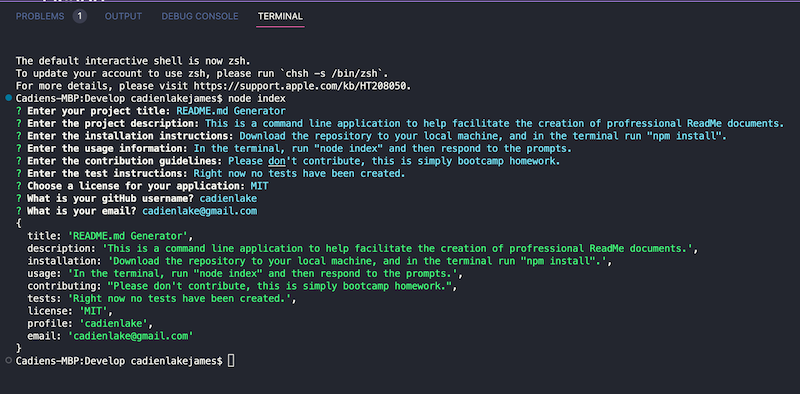
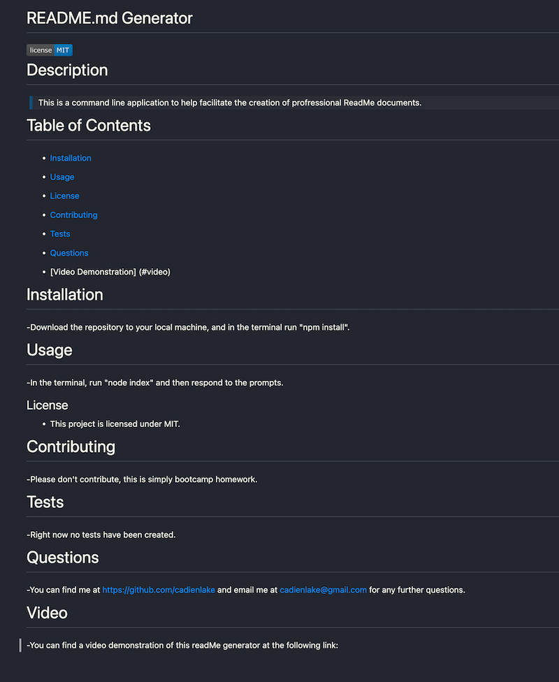

# README.md Generator

## Table of Contents

- [General Info](#general-information)
- [Screenshot](#screenshot)
- [Video](#video)
- [Features](#features)
- [Project Status](#project-status)
- [Acknowledgements](#acknowledgements)

## General Information

-This is a command line application that facilitates the generation of profressional README.md files based on user input.

## Screenshot

  

## Video

> You can find a video demonstration of this application [_here_](https://drive.google.com/file/d/1RRPWksJ4APdsOpK0XiufutFXSBqdz1_g/view?usp=sharing).

## Features

This application utilizes the npm Inquirer in order to process user input. There is a javascript file that takes the user input and places it into the Markdown that is used as the README.md file.

## Project Status

Project is: _finished_.

## Acknowledgements

Give credit here.

- This project was created with assistance from our bootcamp instructor and student conversations. Thanks for the teamwork!
- Thank you to the creators of Inquirer.
